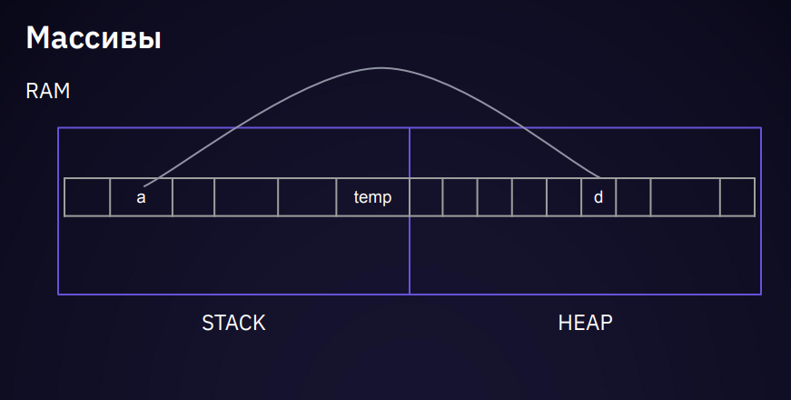
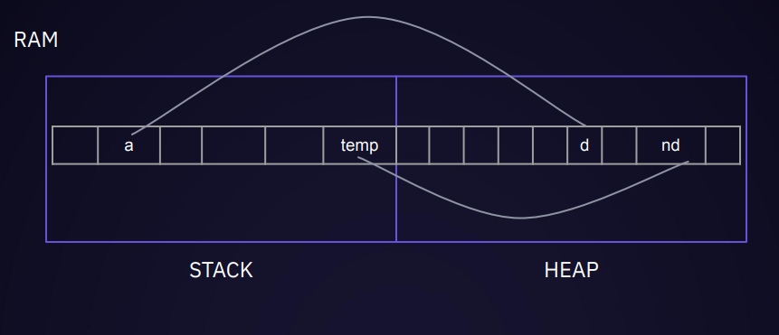
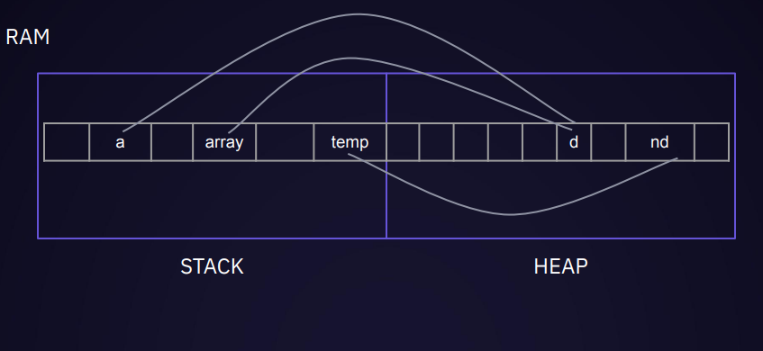
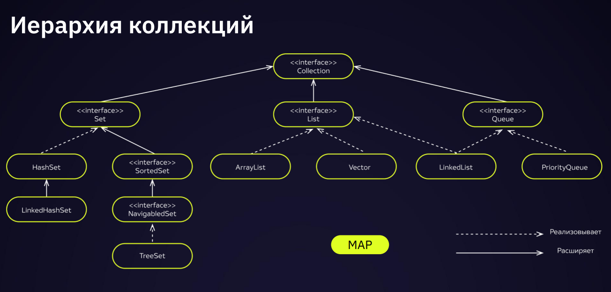

# Коллекции

Тип данных Object – «всему голова»
Упаковка – любой тип можно положить в переменную типа Object
Распаковка – преобразование Object-переменной в нужный тип
Иерархия типов – любой тип «ниже» Object’а

Пример.

```java
public class Ex01_object {
public static void main(String[] args) {
Object o = 1; GetType(o); // java.lang.Integer
o = 1.2; GetType(o); // java.lang.Double
}
static void GetType(Object obj) {
System.out.println(obj.getClass().getName());
}
}
```

Пример со сложением двух чисел:

```java
public class Ex01_object {
public static void main(String[] args) {
System.out.println(Sum(1, 2));
System.out.println(Sum(1.0, 2));
System.out.println(Sum(1, 2.0));
System.out.println(Sum(1.2, 2.1));
}
}
```

Далее

```java
public class Ex01_object {
public static void main(String[] args) {
System.out.println(Sum(1, 2));
System.out.println(Sum(1.0, 2));
System.out.println(Sum(1, 2.0));
System.out.println(Sum(1.2, 2.1));
}
static int Sum(int a, int b) { ...
}
static double Sum(double a, double b) { ...
}
}
```

Далее

```java
public class Ex01_object {
public static void main(String[] args) {
System.out.println(Sum(1, 2));
System.out.println(Sum(1.0, 2));
System.out.println(Sum(1, 2.0));
System.out.println(Sum(1.2, 2.1));
}
static int Sum(int a, int b) { ...
}
static double Sum(double a, double b) { ...
}
static String Sum(String a, String b) { ...
}
}
```

И вот тут нам понадобится объект, с помощью которого мы можем описать методы:

```java
public class Ex01_object {
public static void main(String[] args) {
System.out.println(Sum(1, 2));
System.out.println(Sum(1.0, 2));
System.out.println(Sum(1, 2.0));
System.out.println(Sum(1.2, 2.1));
}
static Object Sum(Object a, Object b) {
if (a instanceof Double && b instanceof Double) {
return (Object)((Double) a + (Double) b);
} else if(a instanceof Integer && b instanceof Integer) {
return (Object)((Integer) a + (Integer) b);
} else return 0;
}
}
```

Однако, проверок может быть множество и наверняка найдется пользователь, который укажет тот тип, на который нет проверки

```java
public class Ex01_object {
public static void main(String[] args) {
System.out.println(Sum(1, 2));
System.out.println(Sum(1.0, 2));
System.out.println(Sum(1, 2.0));
System.out.println(Sum("каша", "маша"));
}
static Object Sum(Object a, Object b) {
if (a instanceof Double && b instanceof Double) {
return (Object)((Double) a + (Double) b);
} else if(a instanceof Integer && b instanceof Integer) {
return (Object)((Integer) a + (Integer) b);
} else return 0;
```

## Массивы

Проблема. Как увеличить размер массива?
Есть массив из 2 элементов
Например

```java
public class Ex01_object {
public static void main(String[] args) {
int[] a = new int[] { 1, 9 };
int[] b = new int[3];
System.arraycopy(a, 0, b, 0, a.length);
for (int i : a) { System.out.printf("%d ", i);} // 1 9
for (int j : b) { System.out.printf("%d ", j);}
// 0 9 0 0 0 0 0 0 0 0
} }
```

Что если захочется реализовать функционал через отдельный метод?

```java
public class Ex01_object {
static int[] AddItem(int[] array, int item) {
int length = array.length;
int[] temp = new int[length + 1];
System.arraycopy(array, 0, temp, 0, length);
temp[length] = item;
return temp;
}
public static void main(String[] args) {
int[] a = new int[] { 0, 9 };
for (int i : a) { System.out.printf("%d ", i); }
a = AddItem(a, 2);
a = AddItem(a, 3);
for (int j : a) { System.out.printf("%d ", j); }
}
}
```

## Память

Как происходит копирование новых данных в имеющийся массив. Слева находится стек, в котором хранятся примитивные объекты и ссылки на те объекты, которые не помещаются в стандартную память, они хранятся в правой части - управляемой куче.



Создается временная переменная, и временный новый массив с данными, в котором лежат новые данные.



Данные первоначального массива записываются также в этот новый массив и переменной а присваивается новая ссылка:



## Иерархия коллекций



## Разные способы создания

```java
ArrayList list = new ArrayList();
```


## Иерархия коллекций. List

List – пронумерованный набор элементов.

Пользователь этого интерфейса имеет точный контроль над тем, где в списке вставляется каждый элемент.

Пользователь может обращаться к элементам по их целочисленному индексу (позиции в списке) и искать элементы в списке.
[URL](https://docs.oracle.com/javase/8/docs/api/java/util/List.html)
ArrayList, LinkedList (Vector, Stack – устаревшие)

### «Удобный массив»

Разные способы создания

```java
ArrayList<Integer> list1 = new ArrayList<Integer>();
ArrayList<Integer> list2 = new ArrayList<>();
ArrayList<Integer> list3 = new ArrayList<>(10);
ArrayList<Integer> list4 = new ArrayList<>(list3);
```

```java
import java.util.ArrayList;
import java.util.List;
public class Ex002_ArrayList {
public static void main(String[] args) {
List list = new ArrayList();
list.add(2809);
list.add("string line");
for (Object o : list) {
System.out.println(o);
// Проблема извлечения данных
}
}
}
```

### Коллекции. Row Type

```java
import java.util.ArrayList;
import java.util.List;
public class Ex002_ArrayList {
public static void main(String[] args) {
List list = new ArrayList();
list.add(2809);
list.add("string line");
for (Object o : list) {
System.out.println(o);
// Проблема извлечения данных
}
}
} // row type java
```

### Коллекции. Save Type

```java
import java.util.ArrayList;
import java.util.List;
public class Ex002_ArrayList {
public static void main(String[] args) {
List<Integer> list = new ArrayList<Integer>();
list.add(1);
list.add(123);
// list.add("string line");
for (Object o : list) {
System.out.println(o);
// Проблема извлечения данных
}
}
}
```

### Функционал

- add(args) – добавляет элемент в список ( в т.ч. на нужную позицию)
- get(pos) – возвращает элемент из списка по указанной позиции
- indexOf(item) – первое вхождение или -1
- lastIndexOf(item) – последнее вхождение или -1
- remove(pos) – удаление элемента на указанной позиции и его возвращение
- set(int pos, T item) – gjvtoftn значение item элементу, который находится
на позиции pos
- void sort(Comparator) – сортирует набор данных по правилу
- subList(int start, int end) – получение набора данных от позиции start до end

```java
import java.util.Arrays;
import java.util.List;
public class Ex004_ArraysMethod {
public static void main(String[] args) {
int day = 29;
int month = 9;
int year = 1990;
Integer[] date = { day, month, year };
List<Integer> d = Arrays.asList(date);
System.out.println(d); // [29, 9, 1990]
}
}
```

```java
import java.util.Arrays;
import java.util.List;
public class Ex004_ArraysMethod {
public static void main(String[] args) {
int day = 29;
int month = 9;
int year = 1990;
Integer[] date = { day, month, year };
List<Integer> d = Arrays.asList(date);
System.out.println(d); // [29, 9, 1990]
}
}
Демо by ref
```

```java
import java.util.Arrays;
import java.util.List;
public class Ex005_ArraysMethod {
public static void main(String[] args) {
StringBuilder day = new StringBuilder("28");
StringBuilder month = new StringBuilder("9");
StringBuilder year = new StringBuilder("1990");
StringBuilder[] date = { day, month, year };
List<StringBuilder> d = Arrays.asList(date);
System.out.println(d); // [29, 9, 1990]
}
}
```

```java
import java.util.Arrays;
import java.util.List;
public class Ex005_ArraysMethod {
public static void main(String[] args) {
StringBuilder day = new StringBuilder("28");
StringBuilder month = new StringBuilder("9");
StringBuilder year = new StringBuilder("1990");
StringBuilder[] date = { day, month, year };
List<StringBuilder> d = Arrays.asList(date);
System.out.println(d); // [29, 9, 1990]
date[1] = new StringBuilder("09");
}
}
```

```java
import java.util.Arrays;
import java.util.List;
public class Ex005_ArraysMethod {
public static void main(String[] args) {
StringBuilder day = new StringBuilder("28");
StringBuilder month = new StringBuilder("9");
StringBuilder year = new StringBuilder("1990");
StringBuilder[] date = { day, month, year };
List<StringBuilder> d = Arrays.asList(date);
System.out.println(d); // [29, 9, 1990]
date[1] = new StringBuilder("09");
System.out.println(d); // [29, 09, 1990]
}
}
```

- clear() – очистка списка
- toString() – «конвертация» списка в строку
- Arrays.asList – преобразует массив в список
- containsAll(col) – проверяет включение всех элементов из col
- removeAll(col) – удаляет элементы, имеющиеся в col
- retainAll(col) – оставляет элементы, имеющиеся в col
- toArray() – конвертация списка в массив Object’ов
- toArray(type array) – конвертация списка в массив type
- List.copyOf(col) – возвращает копию списка на основе имеющегося
- List.of(item1, item2,...) – возвращает неизменяемый список

```java
import java.util.List;
public class Ex006_ListOf {
public static void main(String[] args) {
Character value = null;
List<Character> list1 =
List.of('S', 'e', 'r', 'g', 'e', 'y');
System.out.println(list1);
// list1.remove(1); // java.lang.UnsupportedOperationException
List<Character> list2 = List.copyOf(list1);
}
}
```

```java
import java.util.List;
public class Ex006_ListOf {
public static void main(String[] args) {
Character value = null;
List<Character> list1 =
List.of('S', 'e', 'r', 'g', 'e', 'y');
System.out.println(list1);
// list1.remove(1); // java.lang.UnsupportedOperationException
List<Character> list2 = List.copyOf(list1);
// not null, immutable
}
}
```

## Итератор

Получение итератора с целью более гибкой работы с данными [URL](https://docs.oracle.com/javase/8/docs/api/java/util/Iterator.html) 

Интерфейс Iterator<E>. Итератор коллекцией. Iterator занимает место Enumeration в Java Collections Framework. 

Итераторы отличаются от перечислений двумя способами:
Итераторы позволяют вызывающей стороне удалять элементы из базовой коллекции во время итерации с четко определенной семантикой.

hasNext(), next(), remove()

Получение итератора с целью более гибкой работы с данными [URL](https://docs.oracle.com/javase/8/docs/api/java/util/Iterator.html) 

Интерфейс Iterator<E>. Итератор коллекцией. Iterator занимает место Enumeration в Java Collections Framework. Итераторы отличаются от перечислений двумя способами:
Итераторы позволяют вызывающей стороне удалять элементы из базовой коллекции во время итерации с четко определенной семантикой.

hasNext(), next(), remove()

ListIterator<E> [URL](https://docs.oracle.com/javase/7/docs/api/java/util/ListIterator.html)

hasPrevious(), E previous(), nextIndex(), previousIndex(), set(E e), add(E e)

```java
import java.util.*;
public class Ex007_Iterator {
public static void main(String[] args) {
List<Integer> list = List.of(1, 12, 123, 1234, 12345);
for (int item : list) { System.out.println(item); }
Iterator<Integer> col = list.iterator();
while (col.hasNext()) {
System.out.println(col.next());
}
}
}
```

```java
import java.util.*;
public class Ex007_Iterator {
public static void main(String[] args) {
List<Integer> list = List.of(1, 12, 123, 1234, 12345);
for (int item : list) { System.out.println(item); }
Iterator<Integer> col = list.iterator();
while (col.hasNext()) {
[//System.out.println](https://system.out.println/)(col.next());
col.next();
col.remove();
}
}
}
```