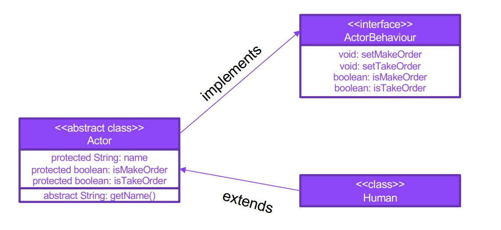
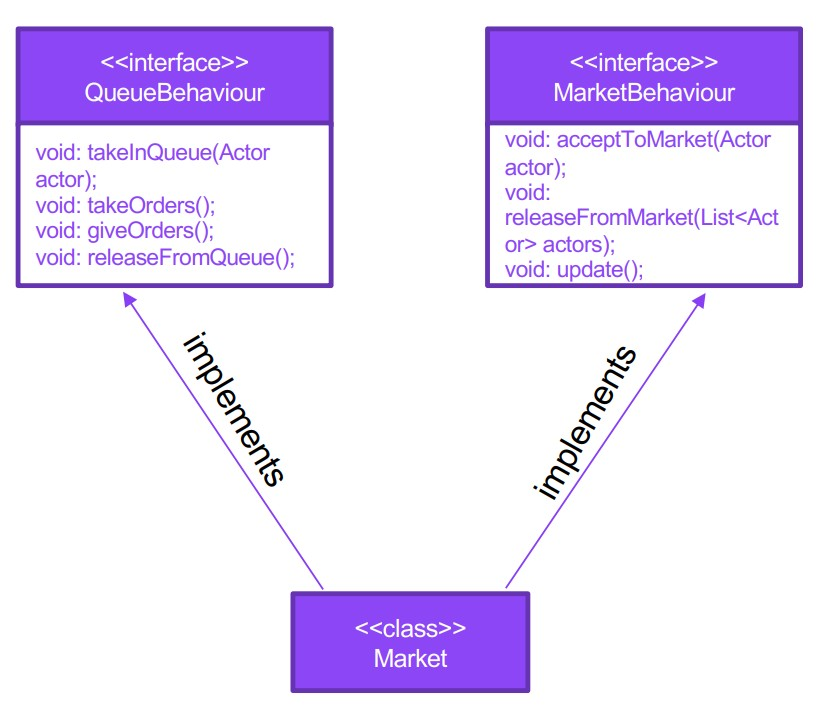

# Abstraction and interfaces. Design example

Task one:
1. The ActorBehavoir interface, which will contain a description of the possible actions of the actor in the queue/store

2. An abstract Actor class that stores the parameters of the actor, including the state of readiness to place
an order and the fact that the order has been received. Addition: for a better understanding, you can make getter methods for the name and others “personal data” abstract

3. The Human class, which should inherit from Actor and implement ActorBehavoir

Task two:
1. Queue Behavior interface, which describes the logic of the queue – placing in/releasing from the queue, accepting/giving an order
2. The MarketBehaviour interface, which describes the logic of the store – the arrival/departure of customers,
updating the status of the store
3. The Market class, which implements the two above interfaces and stores in the list a list of people in the queue in various statuses