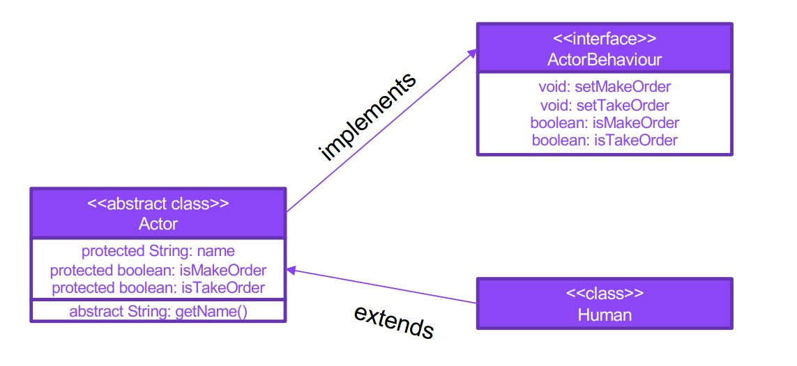

# Abstraction and interfaces. Design example

It is necessary to implement:
1. The ActorBehavoir interface, which will contain a description of the possible actions of the actor in the queue/store

2. An abstract Actor class that stores the parameters of the actor, including the state of readiness to place
an order and the fact that the order has been received. Addition: for a better understanding, you can make getter methods for the name and others “personal data” abstract

3. The Human class, which should inherit from Actor and implement ActorBehavoir