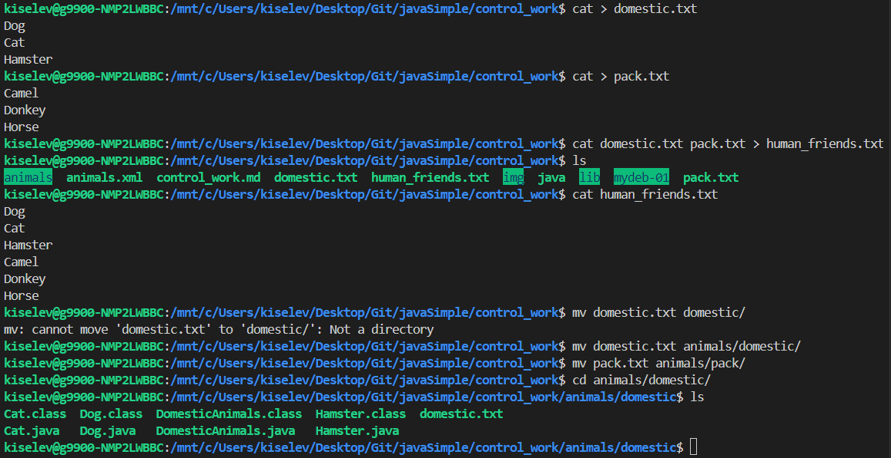
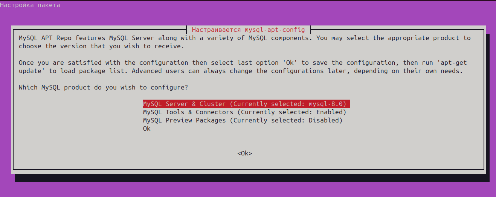
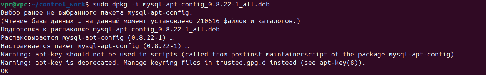
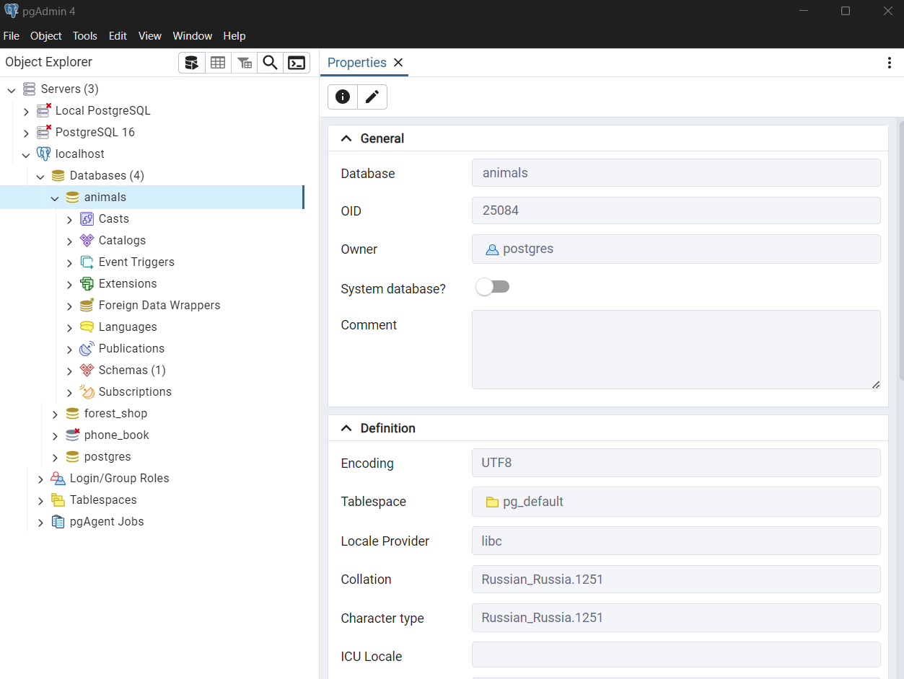
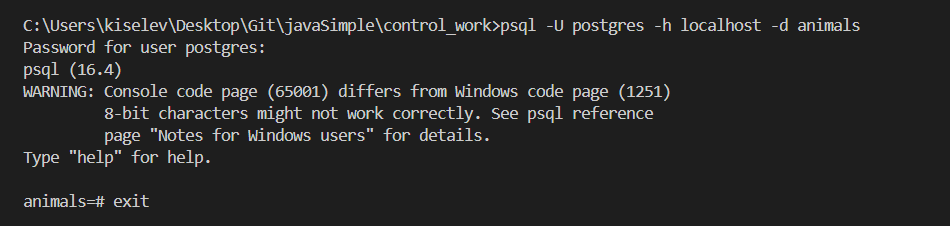
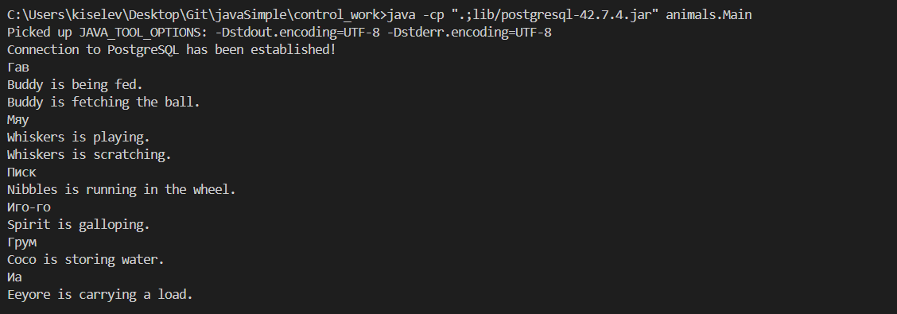
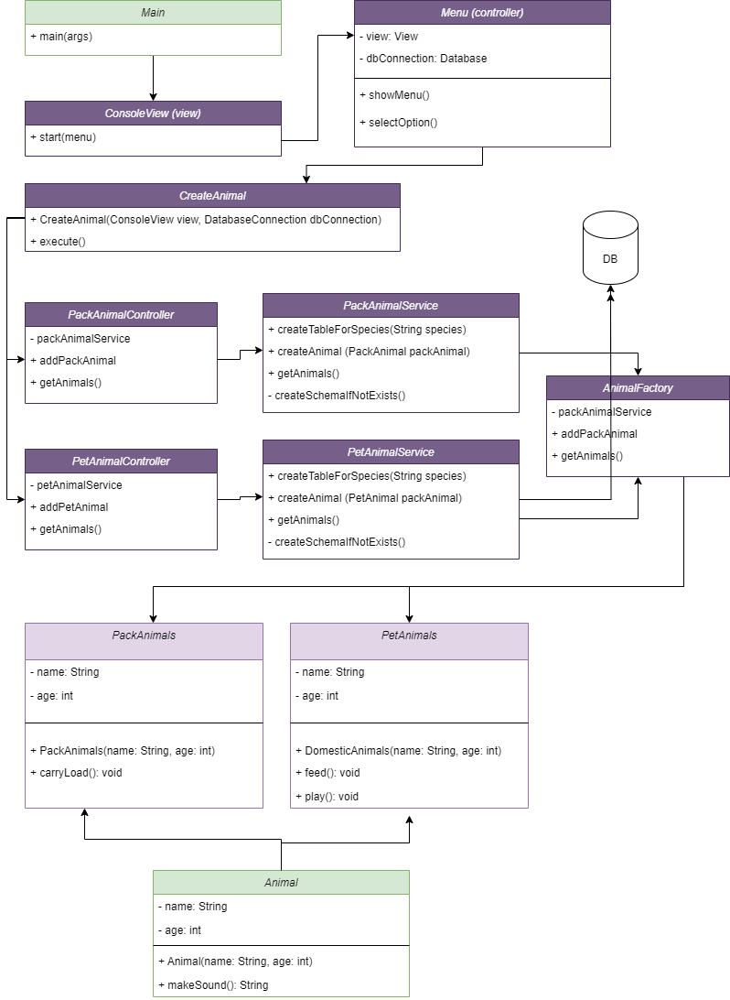

# Control work

1. Use the cat command in the Linux terminal:

- Create two Domestic files by filling the file with Dog, Cat, Humster, and Pack by filling the file with Horse, Camel, and Donkey;
- Merge both files;
- View the contents of the new file;
- Rename the file by giving it a new name.

2. Create a directory, move the file there.
3. Connect additional MySQL repository. Install any package from this repository.
4. Install and remove deb package using dpkg.
5. Post command history in ubuntu terminal
6. Draw a diagram that contains a class parent class, domestic animals and pack animals, which in the case of domestic animals will include the classes: dogs, cats, hamsters, and the class pack animals will include: horses, camels and donkeys.
7. In the connected PostgreSQL repository, create a database “Animals”
8. Create tables with hierarchy from diagram in DB
9. Fill low-level tables with names (of animals), commands they perform and dates of birth
10. Having removed camels from the table, because it was decided to transport camels to another nursery for wintering. Combine the tables of horses and donkeys into one table.
11. Create a new table “young animals” which will include all animals older than 1 year but younger than 3 years and in a separate column with an accuracy of up to a month calculate the age of animals in the new table
12. Merge all tables into one, while preserving the fields indicating previous belonging to the old tables.
13. Create a class with Method Encapsulation and Inheritance according to the diagram.
14. Write a program that simulates the operation of a pet registry.
    The program must implement the following functionality:

- Get a new animal
- assign the animal to the correct class
- see the list of commands that the animal performs
- teach the animal new commands
- Implement menu navigation

15. Create a Counter class that has an add() method that increases the value of an internal int variable by 1 when you click “Get a new pet”. Make it so that you can work with an object of this type in a try-with-resources block. You need to throw an exception if you were not working with a counter-type object in a resource try and/or the resource remains open. Calculate the value in the try resource if all fields are filled in when you add a pet.

## Task 1 - 2

We can work through WSL, which allows you to run a Linux environment on a Windows computer without the need for a separate virtual machine or dual boot.

Let's install and launch the Bash command line from the terminal VScode:

```Terminal
wsl --install
wsl
```

```bash
cat > domestic.txt
Dog
Cat
Hamster
cat > pack.txt
Camel
Donkey
Horse
cat domestic.txt pack.txt > human_friends.txt
cat human_friends.txt
mkdir animals/domestic/
mkdir animals/pack/
mv domestic.txt animals/domestic/
mv pack.txt animals/pack/
```



## Task 3

```bash
wget https://dev.mysql.com/get/mysql-apt-config_0.8.22-1_all.deb
sudo dpkg -i mysql-apt-config_0.8.22-1_all.deb
sudo apt-get update
sudo apt-get install mysql-client
```




Commands for removal:

```bash
sudo service mysql stop
sudo apt remove --purge mysql-server mysql-client mysql-common mysql-server-core-* mysql-client-core-*
sudo apt remove --purge mysql-apt-config
sudo apt autoremove
sudo apt autoclean
dpkg -l | grep mysql
```

However, we will use Postgres for work.

We will need PGAdmin, in which we will create a database for our project.



We will also need a class to connect to the database [DatabaseConnection.java](./animals/DatabaseConnection.class).

Let's check the connection:

```Terminal
psql -U postgres -h localhost -d animals
```



Compilation and assembly is performed through WLS using commands:

```Terminal
javac -cp "lib/postgresql-42.7.4.jar" animals/*.java animals/domestic/*.java animals/pack/*.java
```

And:

```Terminal
java -cp ".;lib/postgresql-42.7.4.jar" animals.Main
```



## Task 4

```bash
wget http://download.videolan.org/pub/debian/stable/vlc_3.0.11-5ubuntu1_amd64.deb
sudo dpkg -i vlc_3.0.11-5ubuntu1_amd64.deb
sudo dpkg -r vlc
sudo dpkg --purge vlc
```

Create your own package:

```bash
mkdir my_new_package
mkdir my_new_package/DEBIAN
nano my_new_package/DEBIAN/control
```

Contents of the control file:

```
Package: myrenamedpackage
Version: 1.0
Section: base
Priority: optional
Architecture: all
Depends:
Maintainer: Name <example@example.com>
Description: A simple example package
 This is a simple example package created for demonstration purposes.
```

Create subdirectory and files that will be installed:

```bash
mkdir -p my_new_package/usr/bin
nano my_new_package/usr/bin/hello
```

Contents of our program:

```bash
#!/bin/bash
echo "Hello, world!"
```

Make file executable:

```bash
chmod +x my_new_package/usr/bin/hello
```

Setting access rights:

```bash
chmod 0755 my_new_package
chmod 0755 my_new_package/DEBIAN
chmod 0755 my_new_package/usr/bin
```

We assemble the package:

```bash
dpkg-deb --build my_new_package
```

Installing the package:

```bash
sudo dpkg -i my_new_package.deb
```

Delete the package:

```bash
sudo dpkg -r my_new_package
```

Checking the deletion:

```bash
dpkg -l | grep my_new_package
```

## Task 6



## Task 7

Let's make sure that the PostgreSQL server is running:

```bash
psql -U postgres -h localhost -p 5432
```

Connecting to the server PostgreSQL:

```Terminal
psql -U postgres -h localhost -p 5432
```

Let's create the database again:

```bash
postgres=# CREATE DATABASE animals;
postgres=# \c animals
You are now connected to database "animals" as user "postgres".
animals=#
```

8. Let's create tables according to the class hierarchy:

```Terminal
-- Создание таблицы для животных
CREATE TABLE animals (
    id SERIAL PRIMARY KEY,
    name VARCHAR(100) NOT NULL,
    age INT NOT NULL,
    birth_date DATE NOT NULL,
    type VARCHAR(50) NOT NULL
);

-- Создание таблицы для собак
CREATE TABLE dogs (
    id SERIAL PRIMARY KEY,
    animal_id INT,
    breed VARCHAR(100) NOT NULL,
    commands TEXT,
    FOREIGN KEY (animal_id) REFERENCES animals(id) ON DELETE CASCADE
);

-- Создание таблицы для кошек
CREATE TABLE cats (
    id SERIAL PRIMARY KEY,
    animal_id INT,
    breed VARCHAR(100) NOT NULL,
    commands TEXT,
    FOREIGN KEY (animal_id) REFERENCES animals(id) ON DELETE CASCADE
);

-- Создание таблицы для хомяков
CREATE TABLE hamsters (
    id SERIAL PRIMARY KEY,
    animal_id INT,
    breed VARCHAR(100) NOT NULL,
    commands TEXT,
    FOREIGN KEY (animal_id) REFERENCES animals(id) ON DELETE CASCADE
);

-- Создание таблицы для ослов
CREATE TABLE donkeys (
    id SERIAL PRIMARY KEY,
    animal_id INT,
    breed VARCHAR(100) NOT NULL,
    commands TEXT,
    FOREIGN KEY (animal_id) REFERENCES animals(id) ON DELETE CASCADE
);

-- Создание таблицы для лошадей
CREATE TABLE horses (
    id SERIAL PRIMARY KEY,
    animal_id INT,
    breed VARCHAR(100) NOT NULL,
    commands TEXT,
    FOREIGN KEY (animal_id) REFERENCES animals(id) ON DELETE CASCADE
);

-- Создание таблицы для верблюдов
CREATE TABLE camels (
    id SERIAL PRIMARY KEY,
    animal_id INT,
    breed VARCHAR(100) NOT NULL,
    commands TEXT,
    FOREIGN KEY (animal_id) REFERENCES animals(id) ON DELETE CASCADE
);
```

Let's fill in the data:

```Terminal
INSERT INTO Animals (name, age, type) VALUES ('Buddy', 3, 'Domestic');
INSERT INTO Animals (name, age, type) VALUES ('Whiskers', 2, 'Domestic');
INSERT INTO Animals (name, age, type) VALUES ('Nibbles', 1, 'Domestic');
INSERT INTO Animals (name, age, type) VALUES ('Spirit', 5, 'Pack');
INSERT INTO Animals (name, age, type) VALUES ('Coco', 4, 'Pack');
INSERT INTO Animals (name, age, type) VALUES ('Eeyore', 6, 'Pack');

INSERT INTO DomesticAnimals (animal_id, breed) VALUES (1, 'Golden Retriever');
INSERT INTO DomesticAnimals (animal_id, breed) VALUES (2, 'Siamese');
INSERT INTO DomesticAnimals (animal_id, breed) VALUES (3, 'Syrian');

INSERT INTO PackAnimals (animal_id, load_capacity) VALUES (4, 300);
INSERT INTO PackAnimals (animal_id, load_capacity) VALUES (5, 500);
INSERT INTO PackAnimals (animal_id, load_capacity) VALUES (6, 200);

INSERT INTO Dogs (animal_id) VALUES (1);
INSERT INTO Cats (animal_id) VALUES (2);
INSERT INTO Hamsters (animal_id) VALUES (3);
INSERT INTO Horses (animal_id) VALUES (4);
INSERT INTO Camels (animal_id) VALUES (5);
INSERT INTO Donkeys (animal_id) VALUES (6);
```

9. Fill low-level tables with names (of animals), commands they perform and dates of birth

10. Created an application that simulates a nursery [Src](./src/)
